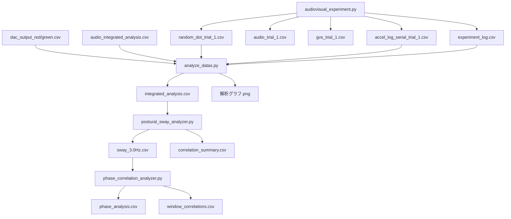

# 📚 視聴覚-平衡感覚統合実験システム Wiki

## 目次

このプロジェクトは、視覚刺激（ランダムドット）、聴覚刺激（パンニング音）、および前庭電気刺激（GVS）を組み合わせた実験システムです。被験者の姿勢動揺（加速度データ）を記録し、各刺激との相関を解析します。

---

### 📖 ドキュメント一覧

| # | ページ | 説明 |
|---|--------|------|
| 1 | [概要](./01-概要.md) | プロジェクトの目的と実験システム全体像 |
| 2 | [ディレクトリ構造](./02-ディレクトリ構造.md) | プロジェクトのフォルダ構成 |
| 3 | [データフロー](./03-データフロー.md) | CSV入出力の流れと各プログラムの関係 |
| 4 | [実験プログラム](./04-実験プログラム.md) | audiovisual_experiment.py の詳細 |
| 5 | [解析プログラム](./05-解析プログラム.md) | データ解析スクリプト群の詳細 |
| 6 | [CSVファイル仕様](./06-CSVファイル仕様.md) | 各CSVファイルのヘッダーと概要 |
| 7 | [コマンドライン引数](./07-コマンドライン引数.md) | 各プログラムの実行方法と引数 |

---

### 🔗 クイックリファレンス

#### 実験実行
```bash
# 実験の実行（PsychoPy環境が必要）
python audiovisual_experiment.py
```

#### データ解析
```bash
# 統合解析
python analyze_datas.py <被験者フォルダ>

# 身体動揺解析
python postural_sway_analyzer.py <被験者フォルダ>

# 位相相関解析
python phase_correlation_analyzer.py <被験者フォルダ>
```

---

### 📊 データフロー概要図



---

### 📁 関連ファイル

- [IMPLEMENTATION_SUMMARY.md](../IMPLEMENTATION_SUMMARY.md) - 実装サマリー
- [REVERSE_SETTINGS_IMPLEMENTATION.md](../REVERSE_SETTINGS_IMPLEMENTATION.md) - リバース設定の実装詳細
- [RANDOM_DOTS_TEST.md](../RANDOM_DOTS_TEST.md) - ランダムドットテスト説明

---

*最終更新: 2025年12月21日*
