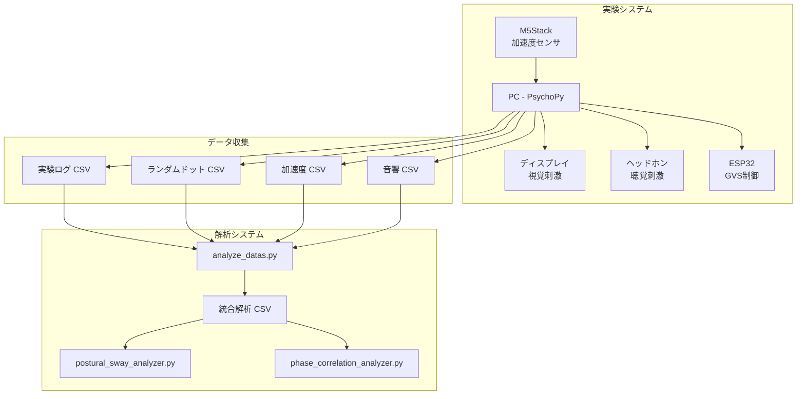

# 📖 1. 概要

## 1.1 プロジェクトの目的

本プロジェクトは、**視聴覚-平衡感覚統合実験システム**の実験制御・データ収集・解析を行うためのPythonプログラム群です。

### 研究背景

視覚、聴覚、前庭感覚（平衡感覚）は、人間の姿勢制御において重要な役割を果たしています。本研究では、これらの感覚刺激が身体動揺（姿勢の揺れ）に与える影響を定量的に解析することを目的としています。

### 実験概要

- **視覚刺激**: 赤・緑のランダムドットが横方向に振動
- **聴覚刺激**: 左右にパンニングする音響
- **前庭電気刺激（GVS）**: 前庭器官への微弱電気刺激
- **計測**: M5Stack加速度センサによる被験者の姿勢動揺

---

## 1.2 システム構成



---

## 1.3 主要ファイル一覧

### 実験プログラム

| ファイル名 | 説明 |
|-----------|------|
| `audiovisual_experiment.py` | メイン実験プログラム（WiFi/シリアル通信対応） |
| `audiovisual_experiment_serial.py` | シリアル通信版実験プログラム |

### 解析プログラム

| ファイル名 | 説明 |
|-----------|------|
| `analyze_datas.py` | 統合データ解析（メイン解析プログラム） |
| `analyze_acceleration.py` | 加速度データの角度変化・相関解析 |
| `postural_sway_analyzer.py` | 身体動揺解析（3Hzローパスフィルタ適用） |
| `phase_correlation_analyzer.py` | 位相相関解析（ロックインアンプ原理） |
| `angle_change_amplitude_analyzer.py` | 角度変化の振幅解析 |
| `angle_change_pattern_analyzer.py` | 相関パターン別振幅解析 |
| `phase_occupancy_analyzer.py` | 位相相関占有時間解析 |
| `phase_condition_comparison_analyzer.py` | 条件間位相相関比較 |

### ユーティリティ

| ファイル名 | 説明 |
|-----------|------|
| `split_accel_log.py` | 加速度ログファイルの分割 |
| `trim_accel_data.py` | 加速度データのトリミング |
| `correlation_visualizer.py` | 相関係数の可視化 |
| `wavelet_coherence.py` | ウェーブレットコヒーレンス解析 |
| `waveform_plot.py` | 波形プロット |

---

## 1.4 実験条件

### 刺激パラメータ

| パラメータ | デフォルト値 | 説明 |
|-----------|-------------|------|
| `WIN_SIZE` | (1920, 1080) | 画面解像度 |
| `N_DOTS` | 3000 | 各色ドット数 |
| `DOT_SIZE` | 15 px | ドット直径 |
| `FALL_SPEED` | 350 px/s | 落下速度 |
| `OSC_FREQ` | 0.1 Hz | 横揺れ周波数 |
| `OSC_AMP` | 300 px | 横揺れ振幅 |
| `TRIAL_DURATION` | 180 s | 試行時間 |

### 実験条件フラグ

| フラグ | 説明 |
|-------|------|
| `VISUAL_STIMULUS_ON` | 視覚刺激ON/OFF |
| `AUDIO_STIMULUS_ON` | 聴覚刺激ON/OFF |
| `GVS_STIMULUS_ON` | GVS刺激ON/OFF |
| `SINGLE_COLOR_DOT` | 単色ドットモード |
| `VISUAL_REVERSE` | 視覚刺激反転 |
| `AUDIO_REVERSE` | 音響刺激反転 |
| `GVS_REVERSE` | GVS刺激反転 |

### 条件（condition）

- **red**: 赤ドットと音響が同期
- **green**: 緑ドットと音響が同期

---

## 1.5 使用ライブラリ

- **PsychoPy**: 視聴覚刺激呈示
- **NumPy/Pandas**: データ処理
- **SciPy**: 信号処理（フィルタ、FFT、相関解析）
- **Matplotlib/Seaborn**: 可視化
- **PySerial**: シリアル通信

---

## 1.6 ドキュメント構成

```
wiki/
├── 00-目次.md                         # 本ファイル
├── 01-概要.md                         # プロジェクト概要
├── 02-ディレクトリ構造.md              # フォルダ構成
├── 03-データフロー.md                  # データ入出力フロー
├── 04-実験プログラム.md                # 実験プログラム詳細
├── 05-解析プログラム.md                # 解析プログラム詳細
├── 06-CSVファイル仕様.md               # CSVヘッダー仕様
└── 07-コマンドライン引数.md            # 実行引数一覧
```

---

*次ページ: [ディレクトリ構造](./02-ディレクトリ構造.md)*
