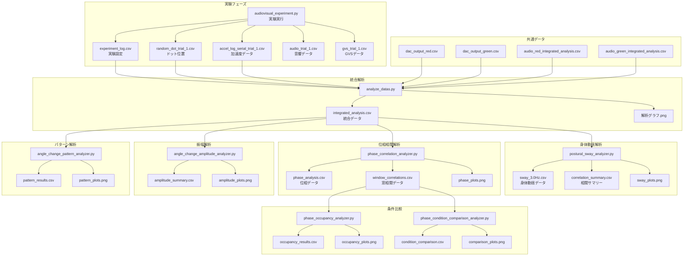
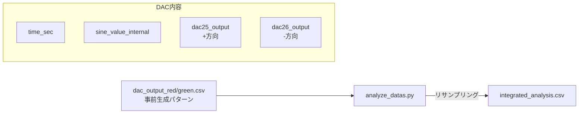
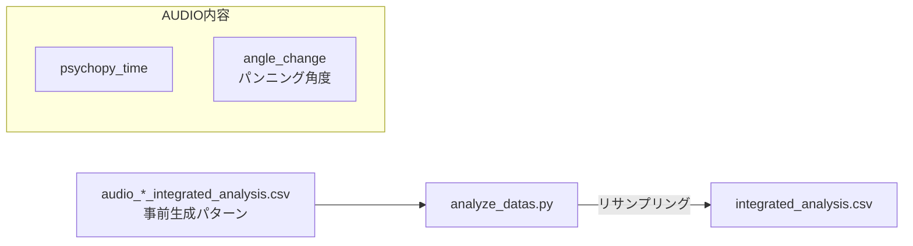
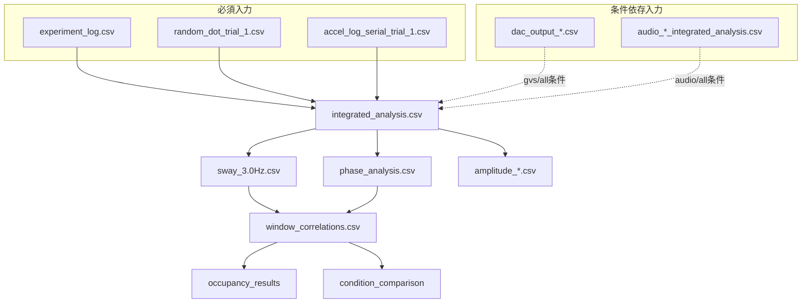

# 🔄 3. データフロー

## 3.1 全体データフロー図



---

## 3.2 プログラム間データフロー詳細

### Phase 1: 実験データ収集

```
audiovisual_experiment.py
    │
    ├─[出力]→ experiment_log.csv        # 実験条件
    ├─[出力]→ random_dot_trial_1.csv    # ドット座標
    ├─[出力]→ accel_log_serial_trial_1.csv  # 加速度
    ├─[出力]→ audio_trial_1.csv         # 音響データ（audio条件時）
    └─[出力]→ gvs_trial_1.csv           # GVSデータ（gvs条件時）
```

### Phase 2: データ統合

```
analyze_datas.py
    │
    ├─[入力]← experiment_log.csv
    ├─[入力]← random_dot_trial_1.csv
    ├─[入力]← accel_log_serial_trial_1.csv
    ├─[入力]← dac_output_red/green.csv    # 共通GVSパターン
    ├─[入力]← audio_red/green_integrated_analysis.csv  # 共通音響
    │
    ├─[出力]→ integrated_analysis.csv     # 統合データ
    └─[出力]→ *.png                       # 解析グラフ
```

### Phase 3: 身体動揺解析

```
postural_sway_analyzer.py
    │
    ├─[入力]← integrated_analysis.csv
    │
    ├─[出力]→ *_sway_3.0Hz.csv           # 3Hzフィルタ適用
    ├─[出力]→ correlation_summary_3.0Hz.csv  # 相関統計
    └─[出力]→ *.png                       # 解析グラフ
```

### Phase 4: 位相相関解析

```
phase_correlation_analyzer.py
    │
    ├─[入力]← integrated_analysis.csv
    │         (または *_sway_3.0Hz.csv)
    │
    ├─[出力]→ phase/*_phase_analysis_3.0Hz.csv
    ├─[出力]→ phase/correlation_visualizations/*_window_correlations_3.0Hz.csv
    └─[出力]→ phase/correlation_visualizations/*.png
```

### Phase 5: 振幅・パターン解析

```
angle_change_amplitude_analyzer.py
    │
    ├─[入力]← integrated_analysis.csv
    │
    ├─[出力]→ angle_change_amplitude_detailed.csv
    ├─[出力]→ angle_change_amplitude_summary.csv
    └─[出力]→ *.png

angle_change_pattern_analyzer.py
    │
    ├─[入力]← integrated_analysis.csv
    │
    ├─[出力]→ pattern_results/*.csv
    └─[出力]→ pattern_results/*.png
```

### Phase 6: 条件比較解析

```
phase_occupancy_analyzer.py
    │
    ├─[入力]← *_window_correlations_3.0Hz.csv (複数被験者)
    │
    ├─[出力]→ occupancy_results/*.csv
    └─[出力]→ occupancy_results/*.png

phase_condition_comparison_analyzer.py
    │
    ├─[入力]← *_window_correlations_3.0Hz.csv (単一被験者)
    │
    ├─[出力]→ phase_condition_comparison_*.csv
    └─[出力]→ *.png
```

---

## 3.3 データ処理の流れ

### 3.3.1 リサンプリング（analyze_datas.py）

```
┌────────────────────────────────────────────────────────┐
│ 元データ                                               │
│ - 加速度: ~120Hz                                       │
│ - ランダムドット: ~60Hz                                │
│ - DAC出力: ~1000Hz                                     │
│ - 音響: ~60Hz                                          │
└────────────────────────────────────────────────────────┘
                           ↓
┌────────────────────────────────────────────────────────┐
│ アンチエイリアシングフィルタ                            │
│ - カットオフ: 24Hz（ナイキスト30Hz×0.8）               │
│ - 4次バターワースローパス                              │
└────────────────────────────────────────────────────────┘
                           ↓
┌────────────────────────────────────────────────────────┐
│ 3次スプライン補間でリサンプリング                       │
│ - 目標: 60Hz統一                                       │
│ - 時間軸: psychopy_time基準                            │
└────────────────────────────────────────────────────────┘
                           ↓
┌────────────────────────────────────────────────────────┐
│ 統合データ (integrated_analysis.csv)                   │
│ - 60Hz統一サンプリング                                 │
│ - 全信号同期済み                                       │
└────────────────────────────────────────────────────────┘
```

### 3.3.2 身体動揺抽出（postural_sway_analyzer.py）

```
┌────────────────────────────────────────────────────────┐
│ integrated_analysis.csv                                │
└────────────────────────────────────────────────────────┘
                           ↓
┌────────────────────────────────────────────────────────┐
│ 3Hzローパスフィルタ                                    │
│ - 4次バターワース                                      │
│ - ゼロ位相フィルタ（filtfilt）                         │
│ → 身体動揺成分（0.1-3Hz）の抽出                        │
└────────────────────────────────────────────────────────┘
                           ↓
┌────────────────────────────────────────────────────────┐
│ 窓相関計算                                             │
│ - 窓サイズ: 10秒                                       │
│ - ステップ: 1秒                                        │
│ - angle_change vs red/green_dot_x_change               │
└────────────────────────────────────────────────────────┘
                           ↓
┌────────────────────────────────────────────────────────┐
│ 出力                                                   │
│ - *_sway_3.0Hz.csv: フィルタ済みデータ                 │
│ - correlation_summary.csv: 統計サマリー                │
└────────────────────────────────────────────────────────┘
```

### 3.3.3 位相解析（phase_correlation_analyzer.py）

```
┌────────────────────────────────────────────────────────┐
│ integrated_analysis.csv                                │
└────────────────────────────────────────────────────────┘
                           ↓
┌────────────────────────────────────────────────────────┐
│ ロックインアンプ原理による位相計算                      │
│ 1. 基準信号生成: sin(2πft), cos(2πft)                 │
│ 2. 入力×基準で同相(I)・直交(Q)成分抽出                │
│ 3. phase = arctan2(Q, I)                              │
│ 4. 位相連続化（unwrap）                                │
└────────────────────────────────────────────────────────┘
                           ↓
┌────────────────────────────────────────────────────────┐
│ 位相差・位相相関計算                                    │
│ - 位相差 = phase_angle - phase_stimulus               │
│ - 位相相関 = circular correlation                      │
└────────────────────────────────────────────────────────┘
                           ↓
┌────────────────────────────────────────────────────────┐
│ 出力                                                   │
│ - *_phase_analysis.csv: 位相データ                     │
│ - *_window_correlations.csv: 窓相関データ              │
└────────────────────────────────────────────────────────┘
```

---

## 3.4 共通データファイルの使用

### GVSデータ（dac_output_*.csv）



- GVS出力 = `dac25_output - dac26_output`
- 条件に応じて `_red.csv` または `_green.csv` を使用

### 音響データ（audio_*_integrated_analysis.csv）



---

## 3.5 出力ファイルの依存関係



---

*前ページ: [ディレクトリ構造](./02-ディレクトリ構造.md) | 次ページ: [実験プログラム](./04-実験プログラム.md)*
