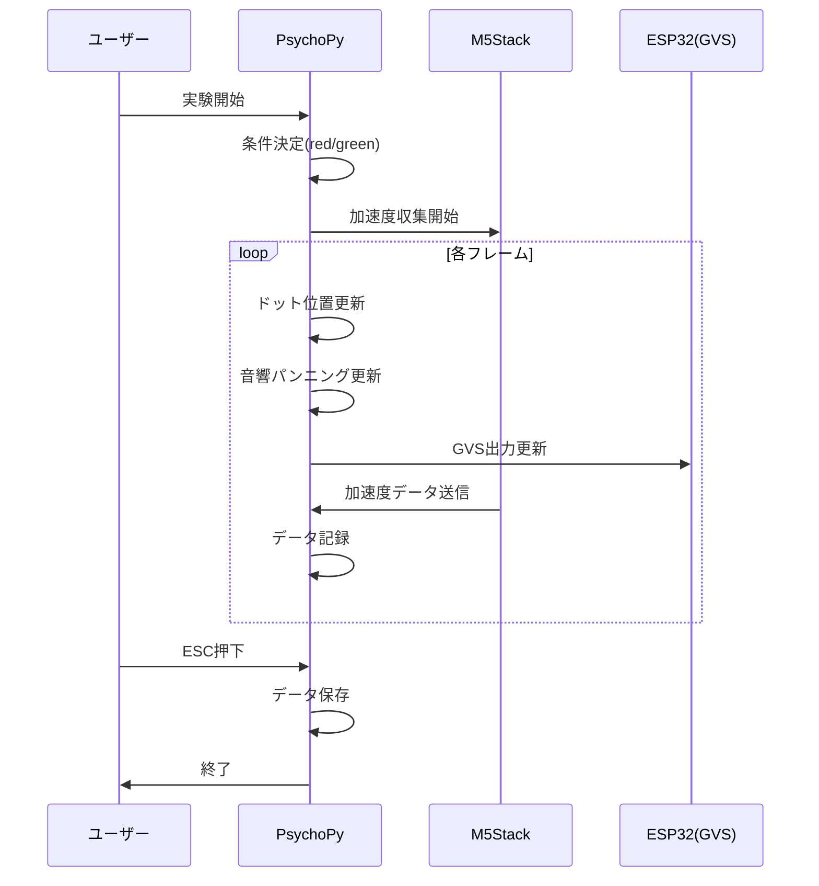

# 🧪 4. 実験プログラム

## 4.1 audiovisual_experiment.py

### 概要

視覚刺激（ランダムドット）、聴覚刺激（パンニング音）、GVS（前庭電気刺激）を統合的に制御し、被験者の姿勢動揺データを収集するメイン実験プログラム。

- **ファイルパス**: [audiovisual_experiment.py](../audiovisual_experiment.py)
- **必要環境**: PsychoPy（PTBオーディオバックエンド）
- **通信方式**: WiFi / シリアル通信

### 主要パラメータ

```python
# 条件制御
FORCE_COND = 'red'              # 強制条件指定（None=ランダム）
VISUAL_STIMULUS_ON = False      # 視覚刺激ON/OFF
AUDIO_STIMULUS_ON = True        # 聴覚刺激ON/OFF
GVS_STIMULUS_ON = False         # GVS刺激ON/OFF
SINGLE_COLOR_DOT = False        # 単色ドットモード
VISUAL_REVERSE = False          # 視覚刺激反転
AUDIO_REVERSE = False           # 音響刺激反転
GVS_REVERSE = False             # GVS刺激反転

# 画面・ドット設定
WIN_SIZE = (1920, 1080)         # 画面解像度
N_DOTS = 3000                   # 各色ドット数
DOT_SIZE = 15                   # ドット直径 [px]
FALL_SPEED = 350                # 落下速度 [px/s]
OSC_FREQ = 0.1                  # 横揺れ周波数 [Hz]
OSC_AMP = 300                   # 横揺れ振幅 [px]

# 音響設定
PANNING_MODE = 'volume'         # 'volume', 'itd', 'both'
AUDIO_SOURCE_MODE = 'mp3'       # 'simulation', 'mp3'
MP3_FILE_RED = "audio_files/red.wav"
MP3_FILE_GREEN = "audio_files/green.wav"

# 通信設定
COMMUNICATION_MODE = 'SERIAL'   # 'WIFI' or 'SERIAL'
SERIAL_PORT = "/dev/cu.wchusbserial..."
SERIAL_BAUDRATE = 115200
```

### 入出力

#### 入力ファイル
| ファイル | 用途 |
|---------|------|
| `audio_files/red.wav` | 赤条件用音源 |
| `audio_files/green.wav` | 緑条件用音源 |

#### 出力ファイル
| ファイル | 説明 |
|---------|------|
| `{timestamp}_experiment_log.csv` | 実験設定・条件ログ |
| `{timestamp}_random_dot_trial_1.csv` | ドット位置データ |
| `{timestamp}_accel_log_serial_trial_1.csv` | 加速度データ |
| `{timestamp}_audio_trial_1.csv` | 音響データ（audio条件時） |

### 処理フロー



### データ整形

1. **ドット位置**: 各フレームで赤・緑ドット群の平均X/Y座標を計算
2. **加速度**: M5Stackから受信した3軸加速度をPsychoPy時間に同期
3. **音響**: 条件に応じたパンニング角度を記録

---

## 4.2 audiovisual_experiment_serial.py

### 概要

シリアル通信専用の簡易版実験プログラム。WiFi通信関連のコードを除去した軽量版。

- **ファイルパス**: [audiovisual_experiment_serial.py](../audiovisual_experiment_serial.py)

### メイン版との違い

| 項目 | audiovisual_experiment.py | audiovisual_experiment_serial.py |
|------|---------------------------|----------------------------------|
| 通信方式 | WiFi/シリアル切替可能 | シリアルのみ |
| GVS制御 | あり | なし |
| 光同期機能 | あり | なし |
| コード量 | ~1800行 | ~560行 |

---

## 4.3 実験条件の設定

### 条件（condition）の決定

```python
# FORCE_COND設定時
if FORCE_COND:
    cond_type = FORCE_COND  # 'red' or 'green'
else:
    cond_type = random.choice(['red', 'green'])
```

### リバース設定の動作

#### SINGLE_COLOR_DOT + VISUAL_REVERSE

```
SINGLE_COLOR_DOT=True, VISUAL_REVERSE=False:
  → condition='red'の場合、緑ドットのみ表示（反対色）
  → condition='green'の場合、赤ドットのみ表示（反対色）

SINGLE_COLOR_DOT=True, VISUAL_REVERSE=True:
  → condition='red'の場合、赤ドットのみ表示（元の条件色）
  → condition='green'の場合、緑ドットのみ表示（元の条件色）
```

#### AUDIO_REVERSE

```
AUDIO_REVERSE=False:
  → condition='red'の場合、赤ドット側に音がパンニング
  
AUDIO_REVERSE=True:
  → condition='red'の場合、緑ドット側に音がパンニング
```

#### GVS_REVERSE

```
GVS_REVERSE=False:
  → condition='red'の場合、赤条件のGVS極性
  
GVS_REVERSE=True:
  → condition='red'の場合、緑条件のGVS極性（逆位相）
```

---

## 4.4 出力ファイルの詳細

### experiment_log.csv

```csv
trial,panning_mode,scrolling_mode,condition,response,RT,...
1,volume,True,red,no_response,-1.000,...
```

主要カラム:
- `trial`: 試行番号
- `panning_mode`: 音響パンニング方式
- `condition`: 実験条件（red/green）
- `single_color_dot`, `visual_reverse`, `audio_reverse`, `gvs_reverse`: 設定フラグ

### random_dot_trial_1.csv

```csv
psychopy_time,red_dot_mean_x,red_dot_mean_y,green_dot_mean_x,green_dot_mean_y
0.0,-10.098,4.286,-16.843,-1.460
0.020023,-3.576,4.219,-23.366,-5.847
```

- サンプリング: ~60Hz（フレームレート依存）
- 座標単位: ピクセル（画面中心が原点）

### accel_log_serial_trial_1.csv

```csv
psychopy_time,accel_time,accel_x,accel_y,accel_z,red_dot_mean_x,...
0.0,0.0,8.921,-0.376,3.742,-10.098,...
0.012,0.012,8.985,-0.302,3.745,-10.098,...
```

- サンプリング: ~120Hz（M5Stack依存）
- 加速度単位: m/s²
- 同時刻のドット位置も記録

---

## 4.5 ハードウェア要件

### M5Stack加速度センサ

- 通信: シリアル（115200bps）
- データ形式: `X,Y,Z` (カンマ区切り)
- サンプリング: ~120Hz

### GVS用ESP32

- 通信: シリアル（115200bps）
- 出力: DAC PIN25(+), PIN26(-)
- 制御: 正弦波出力

### 光同期用Arduino（オプション）

- 用途: オシロスコープ同期用の光信号
- 通信: シリアル（9600bps）

---

## 4.6 実行方法

```bash
# 通常実行
python audiovisual_experiment.py

# デバッグ実行（PsychoPy IDEから）
# Run → Run this experiment

# シリアル通信版
python audiovisual_experiment_serial.py
```

### トラブルシューティング

| 症状 | 原因 | 対処 |
|------|------|------|
| 音が出ない | PTBバックエンド未設定 | prefs設定確認 |
| 加速度データなし | シリアル接続失敗 | ポート名確認 |
| フレームドロップ | GPU負荷 | ドット数削減 |

---

*前ページ: [データフロー](./03-データフロー.md) | 次ページ: [解析プログラム](./05-解析プログラム.md)*
